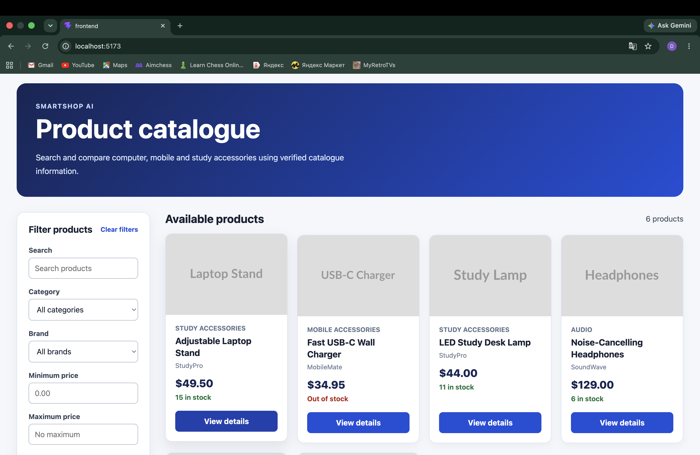
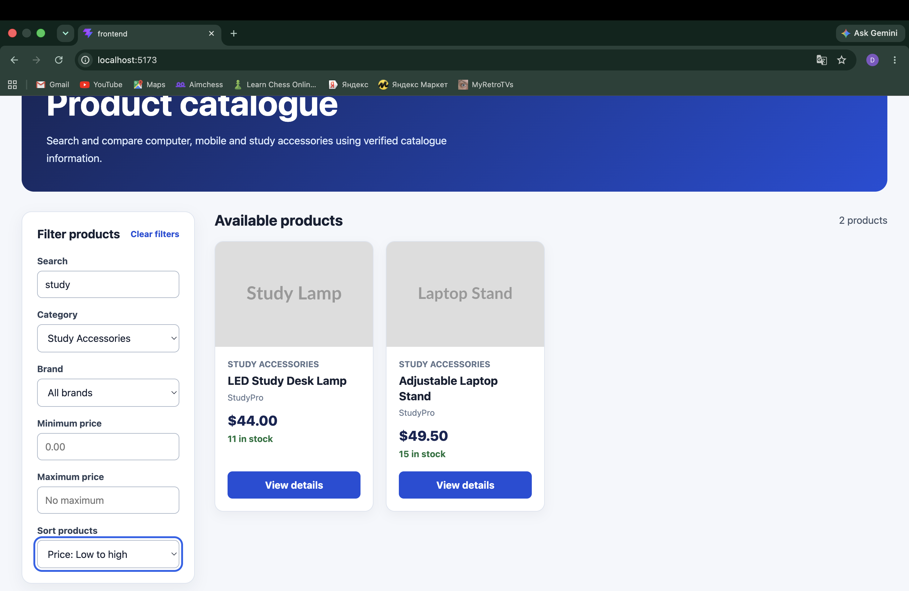
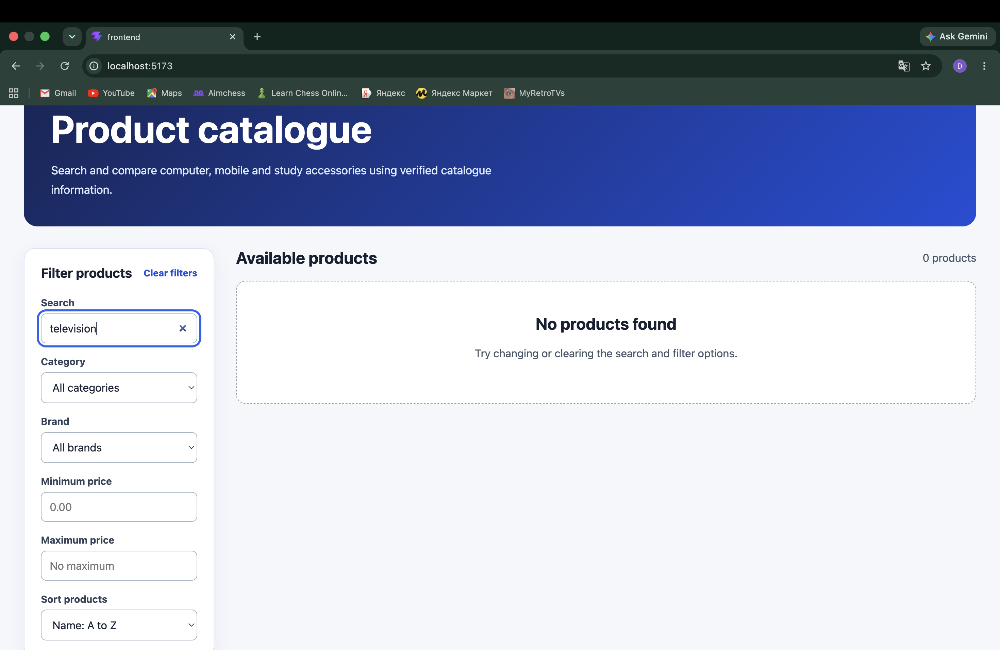
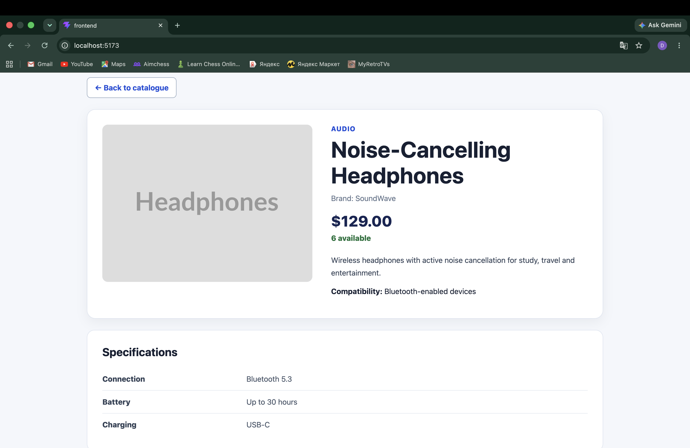

# Product Catalogue UI Design

## Purpose

This document records the user inputs, interface components, design standards and implementation evidence for the SmartShop AI Product Catalogue. The current frontend supports FR1, FR2 and FR3 using temporary mock product data. Integration with the Express API and MySQL database is still pending.

**Feature owner:** Daler Abdukarimov  
**Development branch:** `feature/product-catalogue-ui`

## Requirements Covered

| ID | Requirement | Current Status |
|---|---|---|
| FR1 | Display the product catalogue by category | In Progress |
| FR2 | Search, filter and sort products | In Progress |
| FR3 | Display verified product details | In Progress |

The frontend behaviour is implemented, but these requirements will remain In Progress until the interface retrieves verified information from the MySQL database through the Express API.

## User Data Entry

| User input | UI component | Validation and behaviour |
|---|---|---|
| Search text | Search input | Maximum 100 characters; matching is case-insensitive |
| Category | Dropdown list | User selects one category or all categories |
| Brand | Dropdown list | User selects one brand or all brands |
| Minimum price | Number input | Minimum value is zero; blank means no minimum |
| Maximum price | Number input | Minimum value is zero; blank means no maximum |
| Sort option | Dropdown list | Sorts by product name or price |
| Clear filters | Button | Returns all controls to their default values |
| View details | Button | Opens the selected product details page |
| Back to catalogue | Button | Returns the user to the catalogue |

Search and filter selections are temporary interface values and are not saved in the database.

## Interface Components

| Component | Responsibility |
|---|---|
| `ProductCataloguePage` | Manages catalogue state, filters, sorting and displayed results |
| `ProductFilterPanel` | Collects search, category, brand, price and sorting inputs |
| `ProductGrid` | Displays matching products or the no-results state |
| `ProductCard` | Displays product image, name, brand, price and stock status |
| `ProductDetailsPage` | Displays verified product information, specifications and approved reviews |
| `ProductApiClient` | Will send catalogue requests to the Express API |
| `mockProducts` | Provides temporary development data until API integration |

## Interface States

The catalogue supports the following interface states:

- normal catalogue display;
- filtered product results;
- no matching products;
- available and out-of-stock products;
- individual product details;
- products with approved reviews; and
- products without approved reviews.

Loading and API error states will be activated when the frontend is connected to the Express API.

## User Interface Standards

The interface follows the following standards and design principles:

- semantic HTML elements are used for pages, sections, product cards and reviews;
- every input has a visible label;
- buttons and form controls support keyboard navigation;
- visible focus indicators are provided for keyboard users;
- product images contain alternative text;
- stock availability is communicated using text as well as colour;
- foreground and background colours are designed for readable contrast;
- controls have suitable sizes for mouse and touch interaction;
- Australian prices are displayed in AUD;
- headings follow a logical hierarchy;
- error and no-result messages are written in clear language; and
- the layout changes to a single-column format on smaller screens.

These decisions support relevant WCAG 2.2 accessibility principles and the project’s usability and compatibility requirements.

## Database Input Decisions

The customer’s search, filtering and sorting choices are not stored because they are only required during the current interaction.

The following catalogue information will be stored in MySQL:

| Entity | Information stored |
|---|---|
| Product | Name, description, price, stock, image, compatibility and active status |
| Category | Category name and active status |
| Brand | Brand name and active status |
| Product Specification | Specification name and value |
| Review | Rating, comment, moderation status and related product |
| User | Account and role information required for customers and administrators |

Administrative product entry and editing will be implemented after authentication and role-based access control are available.

## Implementation Evidence

### Default Product Catalogue

The default catalogue displays the available products, filters, prices and stock information.

### Search and Filter Results

The catalogue updates the displayed products when the user applies search, category, brand, price or sorting controls.

### No-Results Handling

A clear message is displayed when no products match the selected criteria.

### Product Details

The product details page displays product information, compatibility, specifications, stock availability and approved reviews.

## Next Development Step

The next step is to connect the React frontend to the Express catalogue API. Product information will then be retrieved from MySQL instead of `mockProducts.js`. After integration, Jeet will execute the catalogue functional, integration and usability tests.