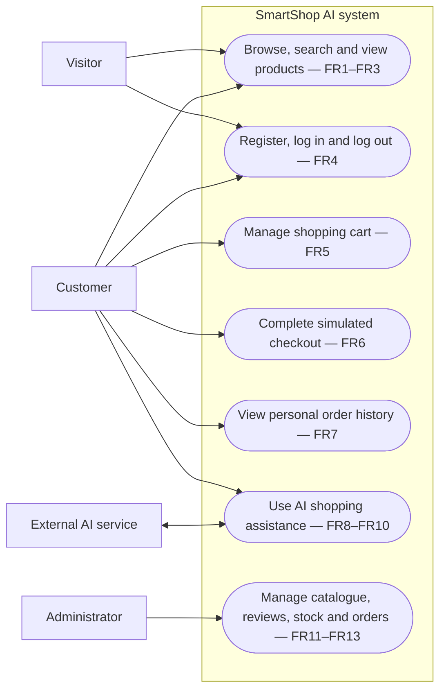
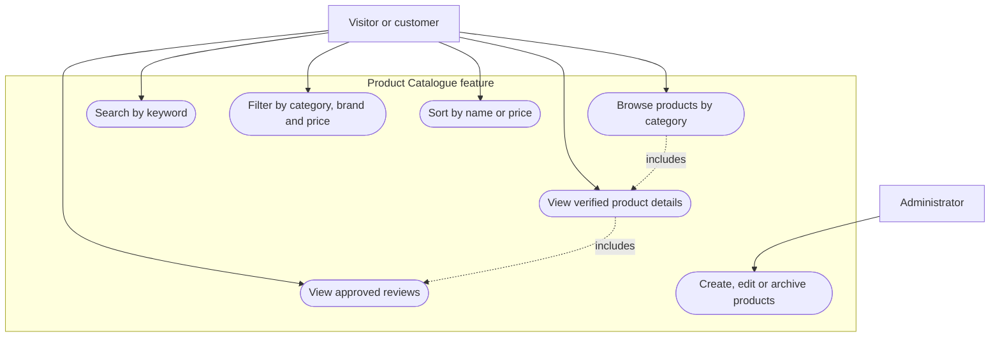
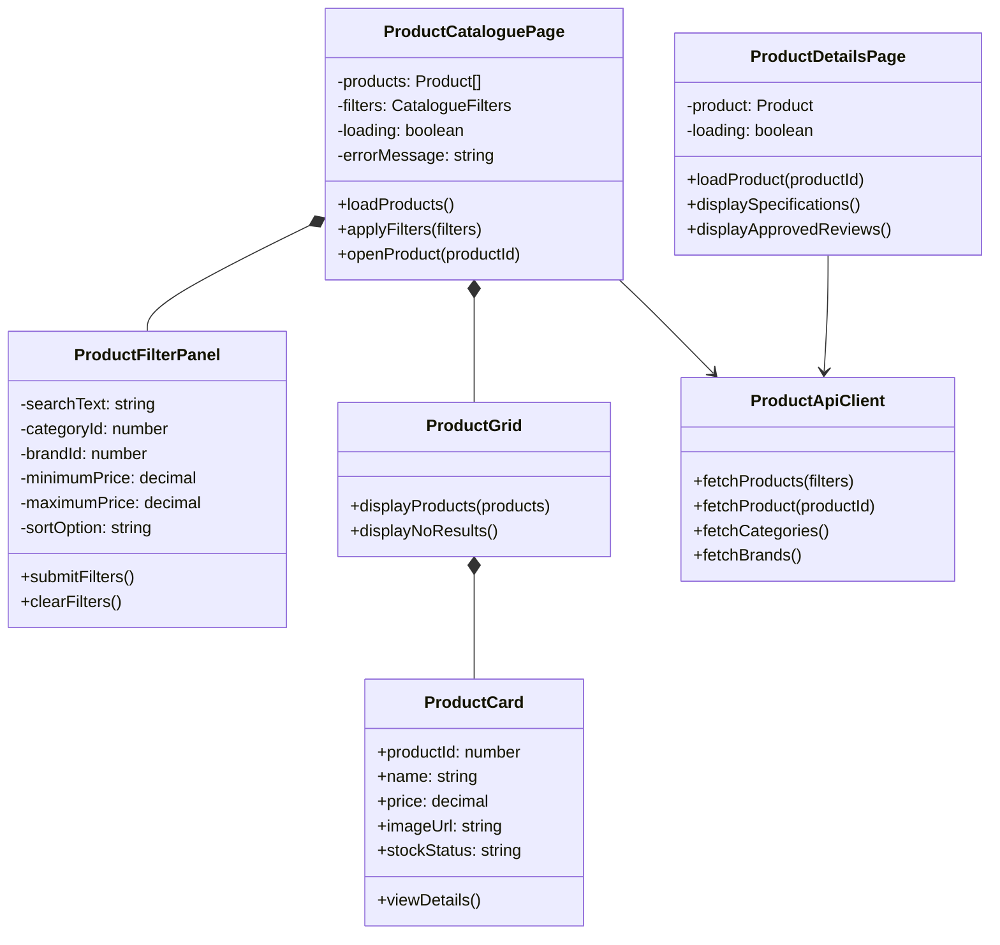
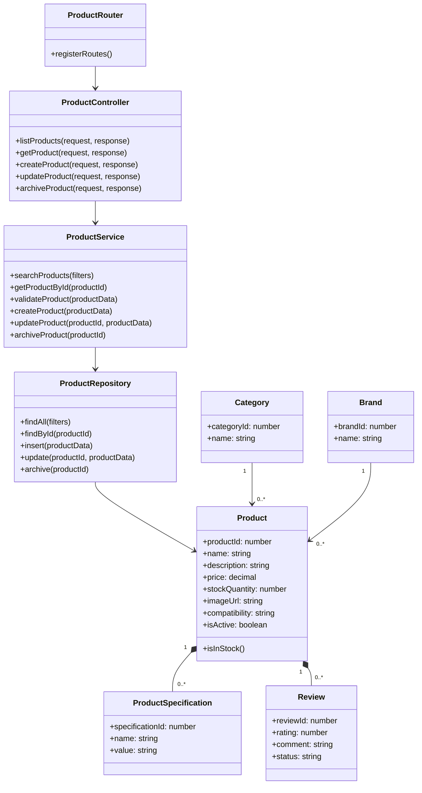
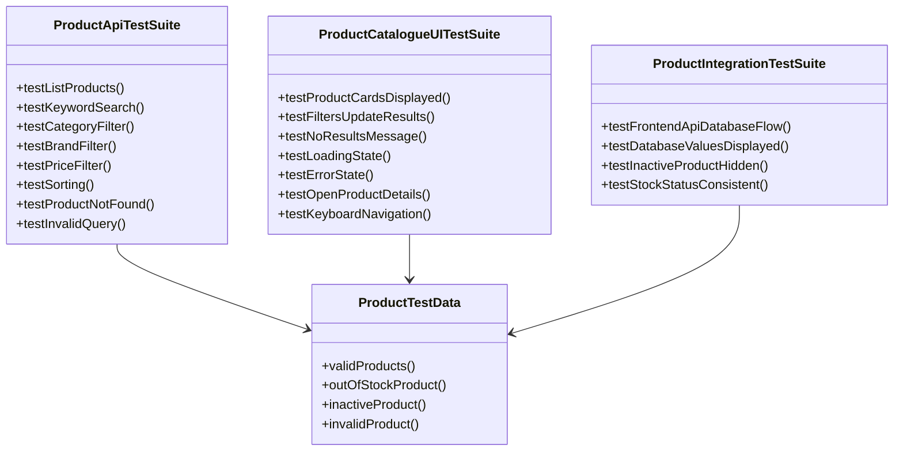
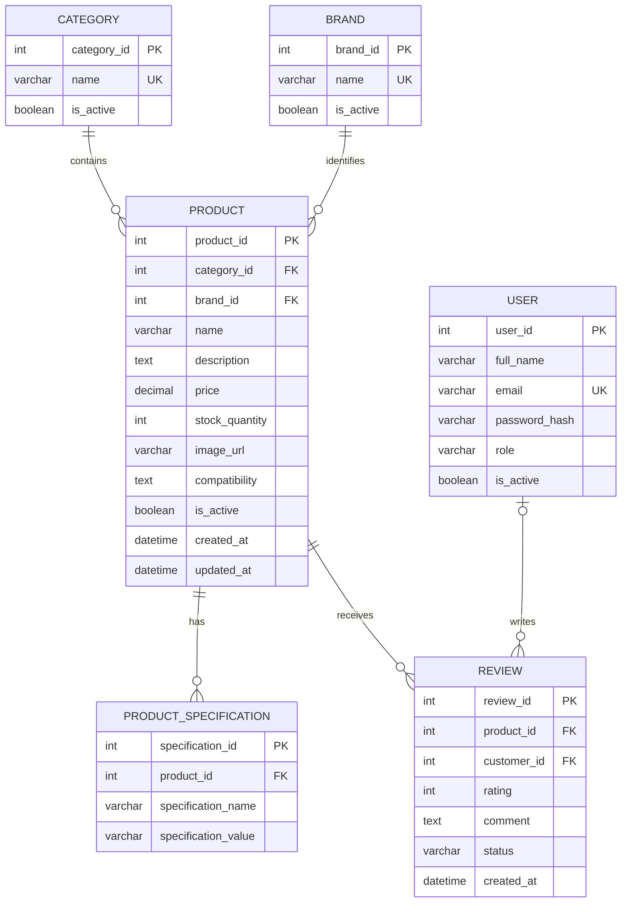
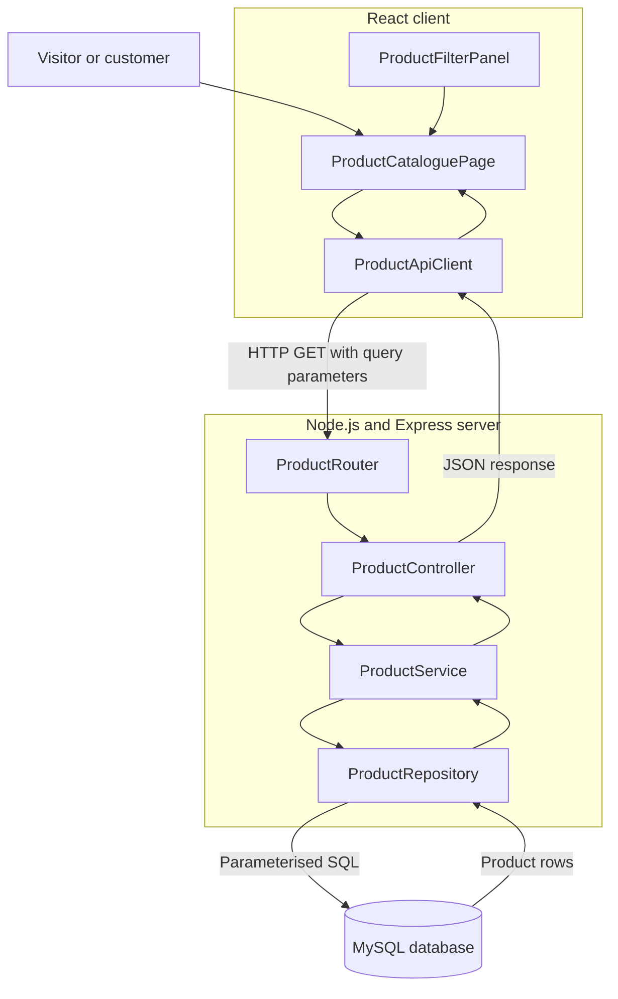
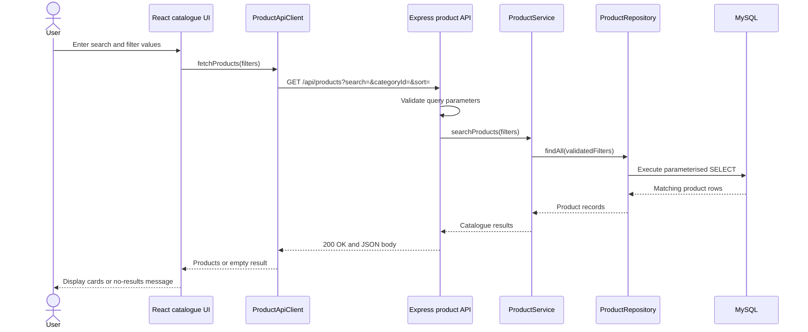

# SmartShop AI — Week Five Design Diagrams

**Unit:** COIT13230 — Application Development Project  
**Project:** SmartShop AI  
**Team:** Daler Abdukarimov, Prabhu Ram Khadka and Jeet Patel  
**Current development increment:** Product Catalogue  
**Requirements covered first:** FR1, FR2 and FR3

These diagrams provide the design baseline required before implementation of the first vertical feature. The Level 1 use-case diagram covers the complete MVP at a high level. The remaining diagrams focus on the Product Catalogue increment assigned across the three team members.

## 1. Level 1 Use-Case Diagram

The oval nodes represent system use cases. The diagram keeps the MVP at Level 1 while linking each function to the approved requirements.

## 2. Product Catalogue Use-Case Detail

This diagram expands the catalogue use case that will be implemented first.

The first implementation covers browsing, searching, filtering, sorting and viewing details. Administrative maintenance is designed now but implemented after authentication and role checks are available.

## 3. Daler — Front-End UML Class Diagram

Daler is responsible for the React catalogue interface and client-side communication module.

## 4. Prabhu — Back-End UML Class Diagram

Prabhu is responsible for the Express API, catalogue business logic, MySQL access and database structure.

## 5. Jeet — Catalogue Testing UML Class Diagram

Jeet is responsible for catalogue test design, repeatable test data, execution evidence and defect reporting.

## 6. Product Catalogue ERD

The ERD keeps repeating specifications in a separate table and allows only approved reviews to be shown publicly. `customer_id` is optional until customer review submission is implemented.

## 7. Client–Server Communication Diagram

This diagram identifies the modules responsible for sending catalogue data from the client and receiving and processing it on the server.

## 8. Catalogue Request Sequence Diagram

The example shows the complete search and filter request from the browser to MySQL and back.

## Design Decisions

- MySQL is the authoritative source for product names, prices, specifications and stock.
- The React client never connects directly to MySQL.
- All filtering inputs are validated on the Express server.
- SQL statements use parameters rather than concatenated user input.
- Archived products remain in the database but are excluded from public catalogue responses.
- Only approved reviews are returned to public product pages.
- The catalogue feature does not depend on the external AI service.
- AI functionality will retrieve catalogue data through controlled server-side modules in a later increment.

## Traceability

| Requirement | Diagram evidence |
|---|---|
| FR1 — Display catalogue by category | Use-case diagrams, front-end classes, back-end classes, ERD and sequence diagram |
| FR2 — Search, filter and sort | Detailed use cases, filter class, API classes and request sequence |
| FR3 — Display verified product details | Use cases, product classes, specifications/review relationships and ERD |
| FR11 — Catalogue administration | Administrator use case and controller/service/repository operations |
| NFR3 — Security | Server validation, role-controlled future administration and parameterised SQL |
| NFR7 — Maintainability | Separate UI, API, service, repository and data modules |
